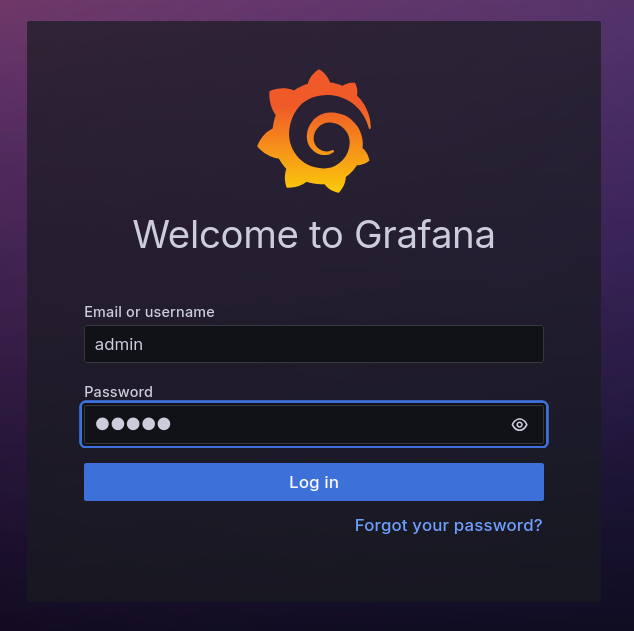
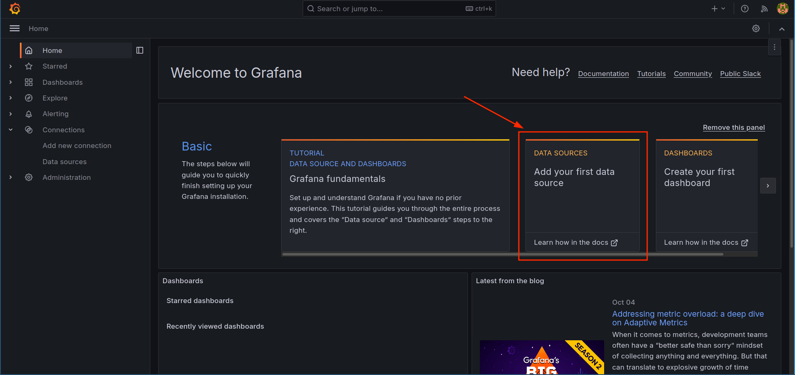
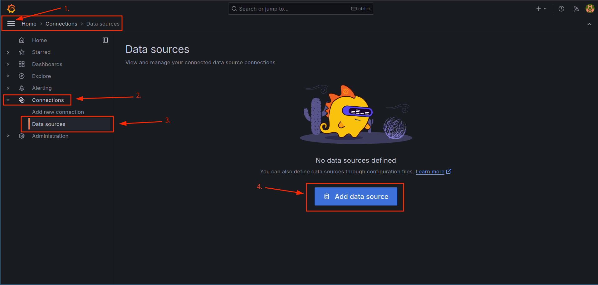
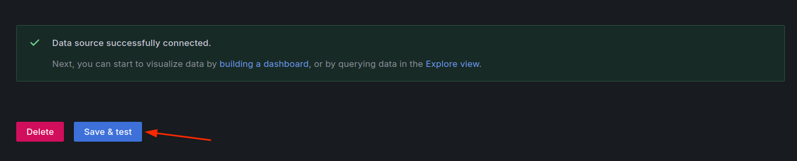

In this step, you will access the Grafana web interface and configure Loki as a data source.
Using this data, you will be able to query and visualize the logs through Grafana.

### Accessing Grafana

1. Open a web browser and navigate to [http://localhost:3000]({{TRAFFIC_HOST1_3000}}).
   You should see the Grafana login page.

2. Log in to Grafana using the default credentials:
   - **Username**: `admin`
   - **Password**: `admin`

   

3. After logging in, you will be prompted to change the password.
   You can skip this or change it as per your preference.

### Configuring Loki as a Data Source

1. To add Loki as a data source there are two options:
    - **Option 1**: Click directly on the shortcut in the main menu as shown below:

      

    - **Option 2**: Click on the gear icon on the left sidebar, then click on `Connections`
      then `Data sources`, and finally "Add data source", as shown below:

      

2. In the `Add data source` page, select `Loki` from the list of available data sources. It should be under the "Logging & document databases" section.

3. In the `Connection` section, configure the `URL` field with `http://loki:3100`:

   

4. Finally, scroll down and click on the `Save & Test` button to save the data source
   configuration and test the connection to Loki. A success message should appear if
   the connection is successful.

   

5. Go back to the home page by clicking on "Home" in the side bar.

In the next step you will learn how to query data from Loki and visualize these logs.
