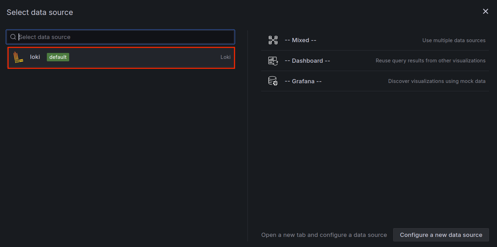
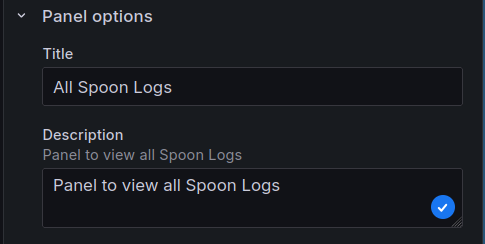

In this step, we will create a dashboard in Grafana to visualize logs stored in Loki. We will use the Loki data source to query logs and display them in a dashboard.

### Create a new dashboard

1. In the Grafana web interface, click on the icon on the left sidebar and select `Dashboard`. Then click on `Create Dashboard`, and select `Add visualization`, as shown below:
   
   

2. Select `Loki` as the data source for the dashboard. 
    

3. On the rigth side, under `Panel Options`, you can give your panel a title and a description. 
       

4. In the query editor, you can write queries to filter and display logs from Loki. For example, you can use the following query to display logs from a specific log file:

```json
{filename="/var/log/spoon.log"}
```

You can set this by either typing it in the `Code` tab or using the `Builder` tab to select the log file. And finally, click on `Run query` to see the logs.
   

If in the Panel something like the following apperars, click on `Switch to Table` to see the logs in a table format.
   

5. Finally, save the dashboard by clicking on the blue `Apply` button, on the top right corner.

In the next step, we will add a new panel to the dashboard to visualize only the error logs.
