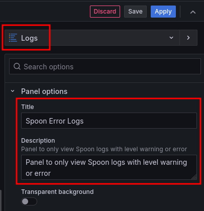
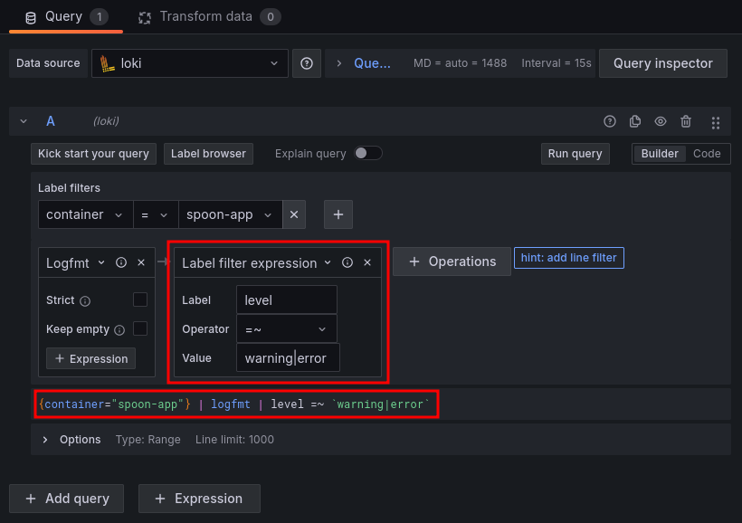
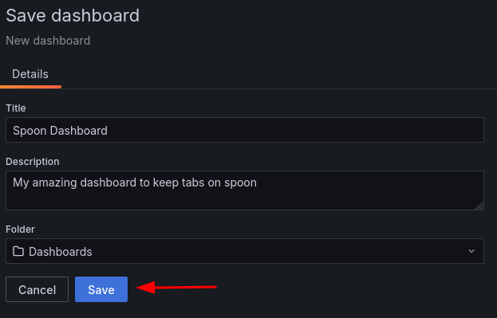
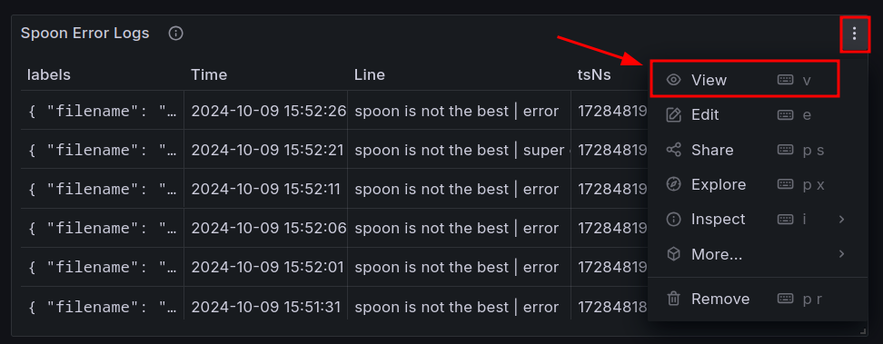
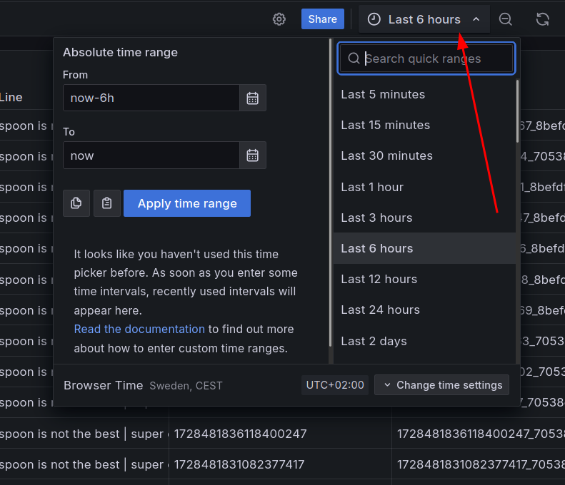

In this step, we will add a new panel to the Grafana dashboard to visualize only the error logs. 

### Add a new panel to the dashboard

1. In the Dashboard view, click on `Add` and then select `Visualization`, as shown below:
   

2. Once again add a title and a description to the panel
   

3. To filter logs that contain the word "error", the process to write the query is similar to the previous step. However, this time we will add a filter to only show logs that contain the word "error". You can use the following query to filter logs that contain the word "error", writing it in the `Code` tab:
```json
{filename="/var/log/spoon.log"} |= "error"
```

Alternatively, you can use the `Builder` tab to select the log file and add the filter for the word "error". You can do this as shown below:
   

This query will filter logs that contain the word "error" from the specified log file.

4. Click on `Run query` to see the logs that match the filter. If necessray, click on the `Switch to Table`. If you see the logs displayed correctly, click on `Apply` to save the panel.

5. To save the dashboard, click on the file icon, as shown below. 
   

Provide a name for the dashboard. You can also add a description if you want. Finally, click on `Save` to save the dashboard.
   

Now your dashboard will not only display a panel with all logs but also a panel that filters logs for errors. You can further customize the dashboard by adding more panels, queries, and visualizations. 

Your dashboard should now look similar to the following:
   

6. You can now see the logs from Loki displayed in the Grafana dashboard. You can customize the dashboard further by adding more panels, queries, and visualizations. Additionally, you can look at the logs with further detail and even select a specific time range to view the logs. You can do this as shown below:
    
    <br>
    <br>
    <br>
    

In the next step, we will set up alerts in Grafana to notify you when specific log messages are detected.
