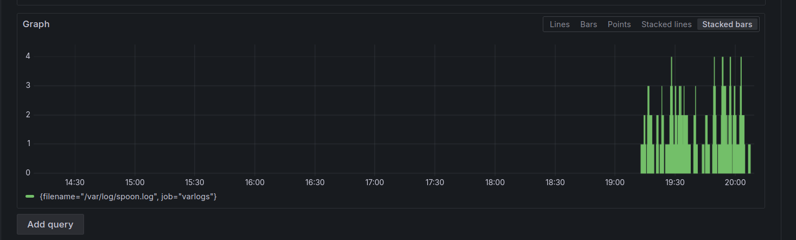

In this step our main focus is to create an alert based on a log pattern. We will create an alert in Grafana that will trigger when a specific log pattern is detected in the logs stored in Loki. This will help us to quickly identify issues and take action when necessary. 

1. First of all, we will start by adding a Contact Point. To do so, click on the menu icon on the left sidebar and select `Alerting`, then `Contact Points`, and finally click on `+ Add Contact point` .
    

2. There are multiple contact points available in Grafana, such as Slack, Discord Webhooks, Emails, and more. For this scenario, we will use the `Webhook` contact point and so you will need to provide a URL where the alert will be sent. Start by naming the contact point as you want and then, on the `Integration` field, select `Webhook` (should be at the bottom of the list).

    

3. Now, for the URL field, access [Webhook.site](https://webhook.site/) and copy `Your unique URL` (by clicking on it) to the `URL` field in Grafana. If you want, you can test if it is working by clicking on `Test` and then `Send Notification`. A green pop-up should appear confirming that the notification was sent and you should see a request on the Webhook site. Finally, to save this contact point, click on `Save Contact Point`.

4. 
    

6. As you could see, some of the error logs are in fact `super error`s. Let's create an alert that will trigger when more than 5 `super error`s are detected in the logs. 
Start by giving a name to the alert.
    

7. Next, change the query type to `Code`. 
    

<br>

Then write the following query to filter logs that contain the word "super error" from the specified log file and count them. The query should look like this:
```json
count_over_time({filename="/var/log/spoon.log"} |= "level=super_error" [10m])
```

It should look like this:
    

7. Click on `Run Query` and you should see something similar to:
    

8. Now, lets set the conditions. Scroll a bit and on `Threshold` set it as shown below:
     

TODO - Finish