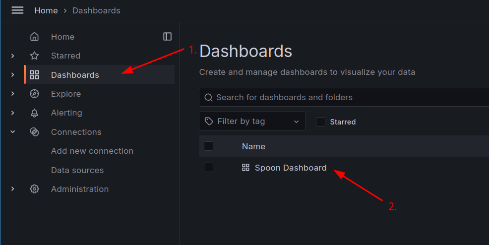

In this step our main focus is to create an alert based on a log pattern. We will create an alert in Grafana that will trigger when a specific log pattern is detected in the logs stored in Loki. This will help us to quickly identify issues and take action when necessary. 

1. First of all, make sure you are in your Spoon Dashboard. If you are not, click on the `Dashboard` icon on the left sidebar and select your dashboard.
    