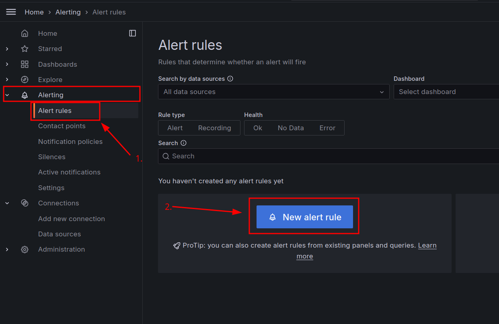
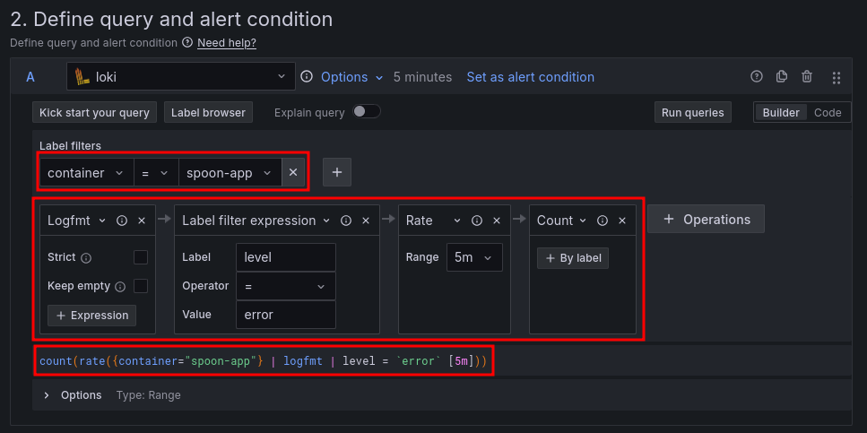
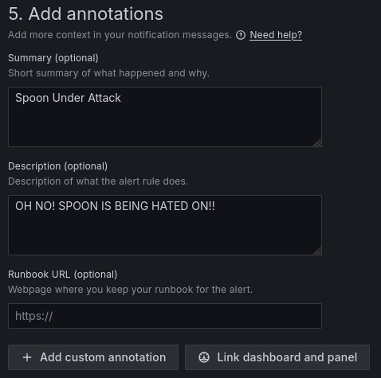
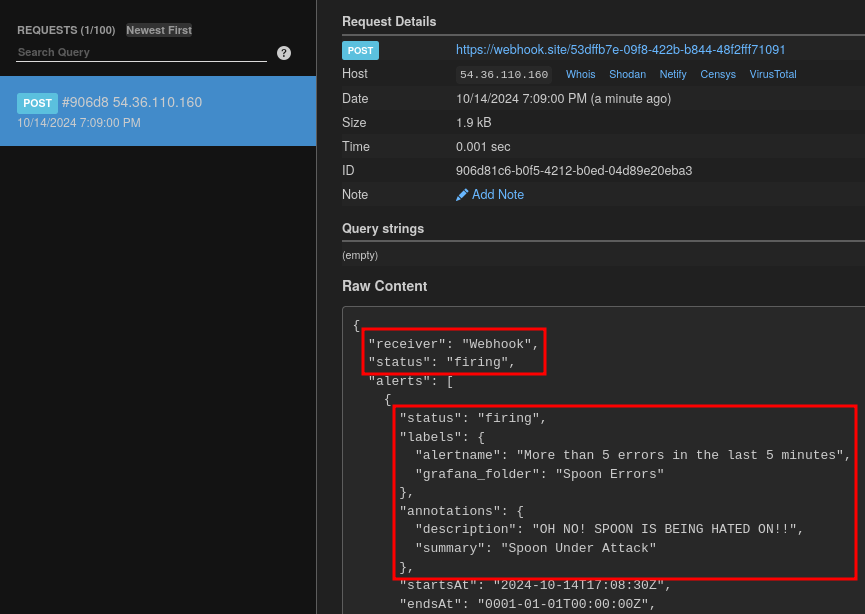

In this step our main focus is to create an alert based on a log pattern. We will create an alert in Grafana that will trigger when a specific log pattern is detected in the logs stored in Loki. This will help us to quickly identify issues and take action when necessary. 

1. First of all, we will start by adding a Contact Point. To do so, click on the menu icon on the left sidebar and select `Alerting`, then `Contact Points`, and finally click on `+ Add Contact point` .
    

2. There are multiple contact points available in Grafana, such as Slack, Discord Webhooks, Emails, and more. For this scenario, we will use the `Webhook` contact point and so you will need to provide a URL where the alert will be sent. Start by naming the contact point as you want and then, on the `Integration` field, select `Webhook` (should be at the bottom of the list).

    

3. Now, for the URL field, access [Webhook.site](https://webhook.site/) and copy `Your unique URL` (by clicking on it) to the `URL` field in Grafana. If you want, you can test if it is working by clicking on `Test` and then `Send Notification`. A green pop-up should appear confirming that the notification was sent and you should see a request on the Webhook site. Finally, to save this contact point, click on `Save Contact Point`.

4. To create a new alert rule, click on the menu icon on the left sidebar and select `Alerting`, then `Alert Rules`, and finally click on `New Alert Rule`, as shown below.
    

6. As you could see, some of the error logs are in fact `super error`s. Let's create an alert that will trigger when more than 5 `super error`s are detected in the logs. 
Start by giving a name to the alert.
    

7. Next, change the query type to `Code`. 
    

<br>

Then write the following query to filter logs that contain the word "super error" from the specified log file and count them. The query should look like this:
```json
count_over_time({filename="/var/log/spoon.log"} |= "level=super_error" [10m])
```

It should look like this:
    

7. Click on `Run Queries`.

8. Now, we need to set the `Expressions`. Scroll a bit and remove `B Reduce` as it is not necessary, as you can see in the image.
     

9. Now, make sure your `Threshold` is set as shown below. This means that the alert will trigger when more than 5 `super error`s are detected in the logs.
    

By clicking on `Preview` you can see how the alert would behave. It can either be `Firing`, as in the image, or `Normal`.

10. To set the evaluation behavior, start by creating a folder for where the alert will be stored. 
    

11. For the evaluation group and interval, create a new one and set the `Evaluation Interval` to `10s`. The pending period should be set to `None` so the alert is triggered as soon as the condition is met. Your `Evaluation behavior` should look like this:
    

12. For `Configuring Labels and Notifications`, set the `Contact Point` to the Webhook previously created. 
    

13. On `Add annotations`, set it as you want. You can add a description, a summary, and more. 
    

14. Finally, click on the blue `Save rule and exit` button on the top right to save the alert.

15. By now, there must be more than 5 `super error`s in the logs. Therefore, if you wait for a few seconds, the alert 's state should change to `Firing`. 
    

Additionally, you can check the Webhook site to see the notification being sent, and it should look like this:
    

Congratulations! You have successfully created an alert in Grafana that triggers when more than 5 `super error`s are detected in the logs stored in Loki. This will help you to quickly identify issues and take action when necessary. You can further customize the alert by adding more conditions, notifications, and actions. You can either create more alerts or customize the existing one to better suit your needs. 
